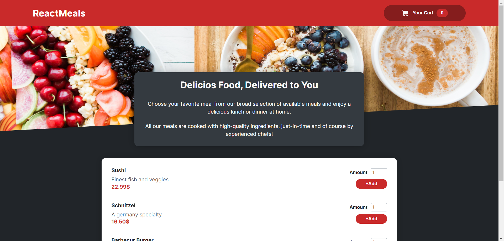
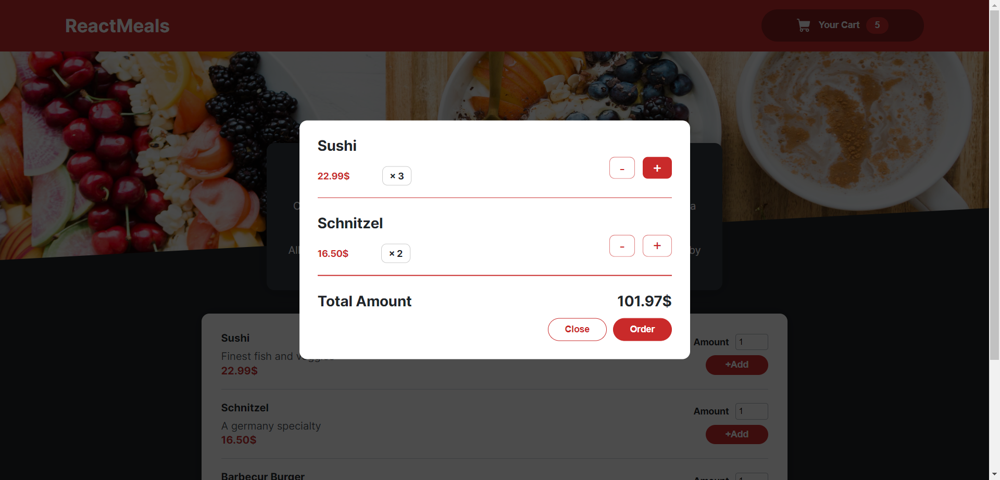

# Food Ordering App with React

Food ordering app that you can add food to your shop cart and manage your orders from there.

## Installation

This project made by React, so you need node.js to run it on your computer locally.

## Overview

Main branch is my own solution for this project and course branch is followed by tuturial way to do the project.

- [Live-Demo](https://ali-food-ordering-app.netlify.app)

## Credits

This project is followed by [React - The Complete Guide 2023 (incl. React Router & Redux)](https://www.udemy.com/course/react-the-complete-guide-incl-redux/) by [Maximilian Schwarzmüller](https://github.com/maxschwarzmueller).

## Author

- Website - [Ali Mashayekhi]()
- X (twitter) - [@alimashayekhi42](https://www.twitter.com/alimashayekhi42)
